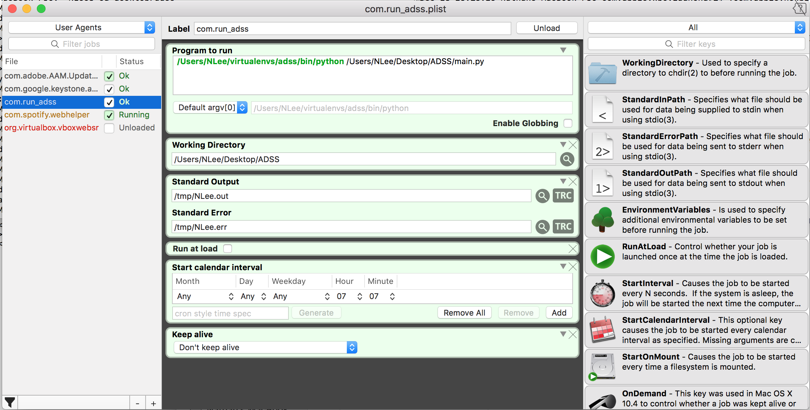

Advertising Department Spreadsheet System
ADSS
--------------------------------------------
An integrated Google Spreadsheets + Python + launchd system to help automate client management.

Google Spreadsheets
--------------------------------------------
Uses the Google Spreadsheets Quickstart API to connect dynamically to the specified Google Spreadsheet. 
Learn how to set up the Google Spreadsheets API here: https://developers.google.com/sheets/api/quickstart/python
NOTE: Used a virtualenv for Python 2.7

The current (private) spreadsheet is linked at the ID: [18XWeVV0Mnsupg6b6tZ6hC6kr7a0LGueT_UpBIriWjNQ]

Python
--------------------------------------------
Uses gspread by burnash for easier Python + Google Spreadsheets integration.
See gspread here: https://github.com/burnash/gspread

Uses MIME for email sending.

launchd
--------------------------------------------
Uses launchd to schedule and execute the python script.
See basic tutorial here: http://killtheyak.com/schedule-jobs-launchd/

The com.run_adss.plist file should be located in the ~/Library/LaunchAgents/ directory (NOTICE: use Terminal to locate and move the file to the appropriate location--the Finder app doesn't reveal the file normally). Then, run 'load ~/Library/LaunchAgents/com.run_adss.plist' to load the file for scheduled execution. NOTE: If the computer host is sleeping during the execution time specified, the script will run one time, the next time the computer is awake. To ensure that the script always runs at the specified time, use the Energy Saver preferences under the main System Preferences app to wake the computer a minute or two before the scheduled script execution. To force the script to run despite the scheduled time, use the 'start com.run_adss' command. To remove the plist, use 'remove com.run_adss' command.

PLIST NOTES: The Program Arguments key takes an array of two strings: (1) the appropriate path to python, which executes (2) the absolute path to main.py. For the appropriate path to python (1), the path of the virtualenv ("adss") is used. For the 'Working Directory' key, include the path to the directory for the python script to be executed inside of (in case the python script calls upon other files in relative scope). In this case, the 'Working Directory' is the folder that main.py is located inside of.

TROUBLESHOOTING: For the 'StandardOutPath' and 'StandardErrorPath' keys in the plist, change 'NLee' to your username. Then run 'tail -f /var/log/system.log' in the Terminal to try debugging (honestly not that useful though).

LaunchControl Screenshot:
